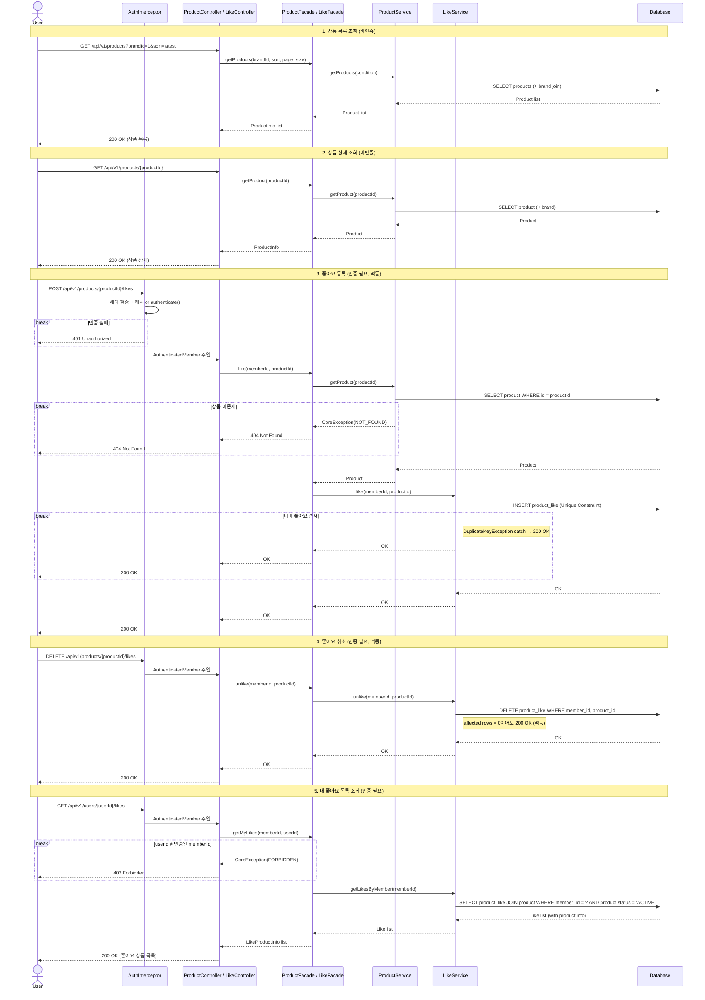
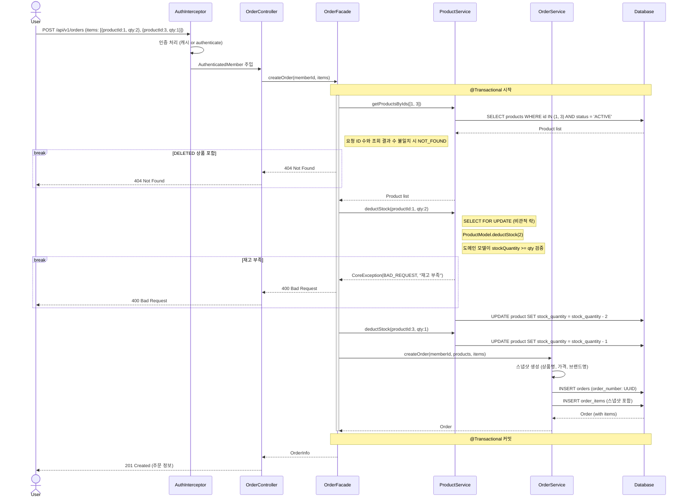
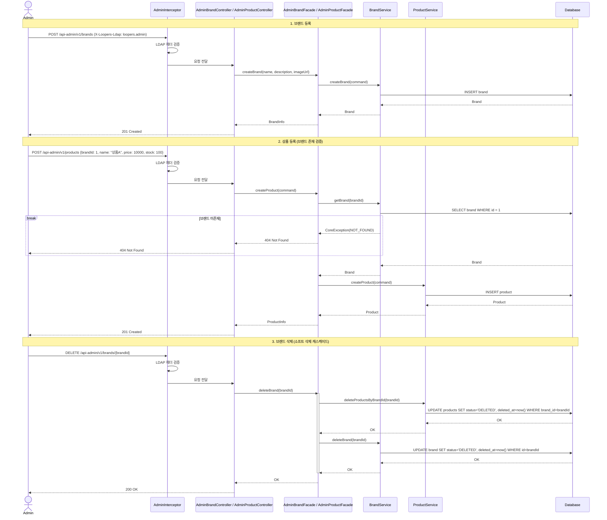
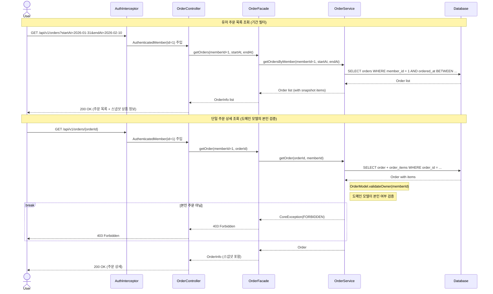
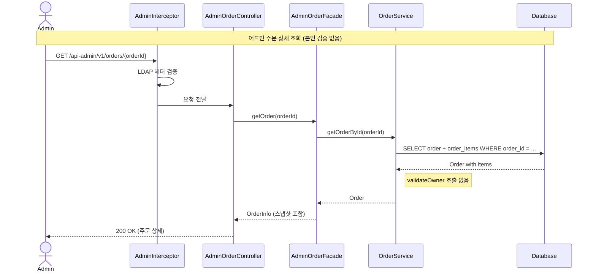

# 02. 시퀀스 다이어그램

---

## 1. 상품 조회 + 좋아요 흐름

### 다이어그램의 목적

사용자가 상품을 탐색하고 좋아요를 누르는 전체 흐름에서 **각 레이어의 책임**과 **인증 처리 시점**을 검증한다.

### 검증 포인트
- 비인증 API(상품 조회)와 인증 API(좋아요)의 처리 경로 차이
- Interceptor에서 인증이 분리되어 Controller가 비즈니스 로직에만 집중하는지
- 좋아요 등록 시 상품 존재 확인이 Facade에서 이루어지는지 (cross-domain 접근은 Facade 레벨)
- 좋아요 등록/취소의 멱등성 처리 방향

### 해석

- **비인증/인증 경로 분리**: 대고객 API는 `@MemberAuthenticated` 어노테이션으로 선택적 인증을 적용한다. 상품 조회는 어노테이션 없이 Controller로 직행하고, 좋아요는 어노테이션이 있어 Interceptor에서 인증 후 `AuthenticatedMember`가 주입된다.
- **상품 존재 확인은 Facade에서**: `LikeFacade`가 `ProductService.getProduct()`를 호출하여 상품 존재를 확인한다 (BR-L4). cross-domain 접근은 Facade 레벨에서 조합하는 원칙을 따른다.
- **좋아요/취소 멱등 처리**: 좋아요 등록 시 DB Unique Constraint로 중복을 방지하되, `DuplicateKeyException` 발생 시 catch하여 200 OK를 반환한다. 좋아요 취소 시 대상이 없어도(affected rows = 0) 200 OK를 반환한다. 결과 상태("좋아요 있음/없음")가 요청 의도와 일치하면 성공이다.
- **내 좋아요 목록 조회**: `LikeFacade`가 본인 여부를 검증한 후(BR-L3: `userId = 인증된 사용자`), `LikeService`에서 `product_like` JOIN `product WHERE status = 'ACTIVE'`로 실시간 조회한다. 좋아요/취소는 즉시 반영되며, 삭제된 상품은 자동 필터링된다.
- **좋아요 수 조회**: 상품 조회 시 `product` 테이블의 `like_count` 컬럼을 직접 반환한다. 배치가 주기적으로 갱신하므로 런타임 COUNT 부하가 없다.

---

## 2. 주문 생성 흐름

### 다이어그램의 목적

여러 상품을 한 번에 주문하는 핵심 플로우에서 **도메인 모델의 재고 불변식 보호**와 **스냅샷 저장 시점**을 검증한다.

### 검증 포인트
- 재고 검증이 도메인 모델 내부에서 이루어지는지 (Facade는 비즈니스 판단 없음)
- 상품 스냅샷이 주문 시점에 저장되는지
- 재고 부족 시 실패 처리가 명확한지

### 해석

- **ACTIVE 상품만 주문 가능**: `getProductsByIds`에서 `status = 'ACTIVE'` 조건으로 조회한다. DELETED 상품이 요청에 포함되면 조회 결과 수 불일치로 NOT_FOUND를 반환한다. 재고가 0인 상품도 ACTIVE 상태이므로 조회는 되지만, `deductStock()`에서 재고 부족으로 실패한다.
- **도메인 모델의 불변식 보호**: `ProductModel.deductStock(qty)`이 내부에서 `stockQuantity >= qty`를 검증한다. 재고 부족 시 도메인 모델이 예외를 던지며, Facade는 비즈니스 판단 로직을 갖지 않는다.
- **트랜잭션 경계**: Facade 레이어에서 `@Transactional`로 재고 차감과 주문 생성을 하나의 트랜잭션으로 묶는다. 재고 차감 후 주문 생성이 실패하면 전체 롤백된다.
- **스냅샷 저장**: OrderItem에 주문 시점의 상품명(`productName`), 가격(`productPrice`), 브랜드명(`brandName`)을 복사하여 저장한다 (BR-O2).
- **재고 동시성 제어**: `ProductService.deductStock()`에서 비관적 락(`SELECT FOR UPDATE`)을 적용하여 동시 주문 시 재고 정합성을 보장한다. 재고 차감은 정합성이 핵심이므로 Phase 1(기능 구현)에 포함한다.

---

## 3. 어드민 브랜드/상품 관리 흐름

### 다이어그램의 목적

어드민이 브랜드와 상품을 관리하는 흐름에서 **LDAP 인증 처리**, **소프트 삭제 캐스케이드**, **어드민 전용 Facade 분리**를 검증한다.

### 검증 포인트
- 어드민 인증이 대고객 인증과 독립적으로 동작하는지
- 브랜드 삭제 시 하위 상품이 소프트 삭제 처리되는지
- 상품 등록 시 브랜드 존재 여부 검증이 이루어지는지
- 어드민 전용 Facade를 통해 요청이 처리되는지

### 해석

- **어드민 Facade 분리**: `AdminBrandFacade`, `AdminProductFacade`가 어드민 전용 유스케이스를 처리한다. 고객용 Facade와 분리되어 독립적으로 진화 가능하다. Service는 공유한다.
- **어드민 인증 분리**: `AdminAuthenticationInterceptor`가 `X-Loopers-Ldap` 헤더를 검증한다. 대고객 `MemberAuthenticationInterceptor`와 독립적으로 동작하며, `@AdminAuthenticated` 어노테이션으로 클래스 레벨 일괄 적용된다. 대고객 인증(`@MemberAuthenticated`)과 동일한 어노테이션 기반 패턴으로 일관성을 유지한다 (어드민은 전 엔드포인트 인증 필수).
- **소프트 삭제 캐스케이드**: 브랜드 삭제 시 하위 상품을 먼저 소프트 삭제(`status=DELETED`, `deleted_at=now()`)한 후 브랜드를 소프트 삭제한다. 주문 스냅샷이 상품을 참조하므로 물리 삭제 불가.
- **상품 등록 시 브랜드 검증**: `AdminProductFacade`가 `BrandService.getBrand()`을 호출하여 브랜드 존재 여부를 확인한다 (BR-P1). cross-domain 접근은 Facade 레벨에서 조합한다.
- **상품 등록 시 좋아요 수 초기화**: `product` 테이블의 `like_count` 컬럼이 DEFAULT 0으로 정의되어, 상품 등록 시 별도 초기화 없이 자동으로 0이 설정된다.
- **브랜드 삭제 시 좋아요 데이터 유지**: 캐스케이드 범위는 상품 soft delete까지이며, `product_like` 데이터는 삭제하지 않는다. 마케팅/추천 데이터로 활용 가능하며, 내 좋아요 목록 조회 시 ACTIVE 필터링으로 자연스럽게 제외된다.

---

## 4. 주문 조회 흐름

### 다이어그램의 목적

대고객의 주문 조회 흐름에서 **도메인 모델의 접근 제어**(본인 주문만 조회)와 **스냅샷 데이터 반환**을 검증한다. 어드민 주문 조회와의 차이(본인 검증 유무)를 대비한다.

### 해석

- **도메인 모델의 접근 제어**: 대고객 경로에서 `OrderModel.validateOwner(memberId)`가 본인 여부를 검증한다. "본인 주문만 조회 가능" 규칙은 Order 도메인의 비즈니스 규칙이므로, 도메인 모델이 자기 규칙을 보호한다.
- **어드민 주문 조회**: `AdminOrderFacade`는 `OrderService.getOrderById(orderId)`를 호출하며, `validateOwner`를 수행하지 않는다. 어드민은 모든 주문을 조회할 수 있다.
- **스냅샷 반환**: OrderItem에 저장된 스냅샷(상품명, 가격, 브랜드명)을 그대로 반환한다. 현재 상품 정보와 무관하게 주문 당시의 정보를 보여준다.
- **기간 필터**: 대고객 주문 목록에서 `startAt`, `endAt` 파라미터로 `ordered_at` 기준 범위 검색을 수행한다.
