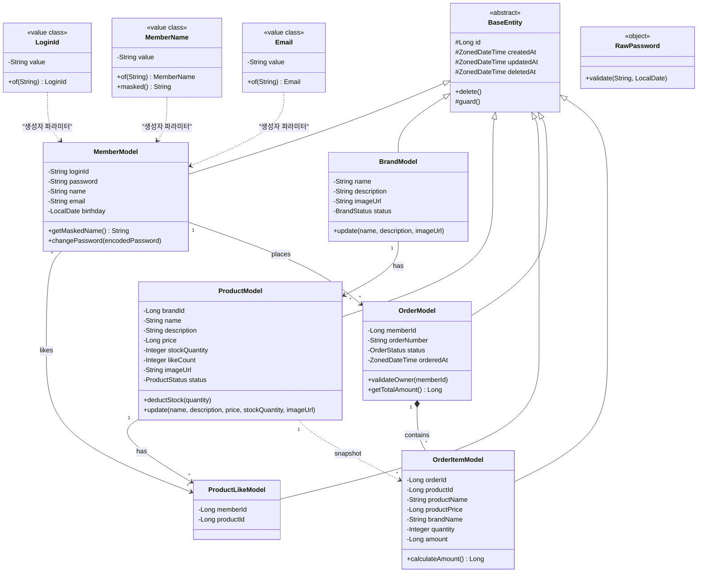
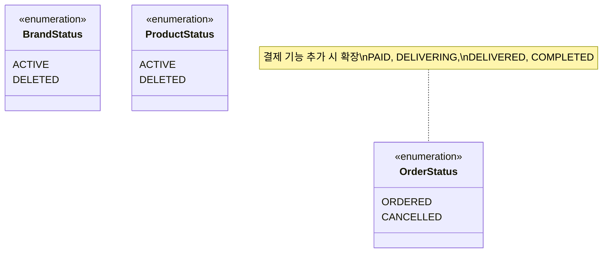

# 03. 클래스 다이어그램

---

## 1. 전체 도메인 관계

### 다이어그램의 목적

도메인 간 의존 방향과 핵심 책임을 파악한다. 각 도메인이 독립적으로 존재하되, 최소한의 참조(ID)로만 연결되는지를 검증한다.



### 해석

- **ID 참조 원칙**: 도메인 간 직접 객체 참조 대신 ID(`brandId`, `memberId`, `productId`)로 연결한다. 이는 도메인 간 결합을 최소화하여 향후 서비스 분리를 대비한다.
- **BaseEntity 상속**: 모든 엔티티는 `BaseEntity`를 상속하여 `id`, `createdAt`, `updatedAt`, `deletedAt`, `delete()`를 공유한다. `guard()`는 삭제된 엔티티에 대한 연산을 차단하는 보호 메서드로, 서비스에서 고객 조회 시 DELETED 리소스 접근을 방지한다 (Decision 21). 다이어그램에서 개별 모델은 BaseEntity에서 상속받는 필드를 생략하고 도메인 고유 필드만 표시한다.
- **관계 유형**: 실선 화살표(`-->`)는 연관(association)으로 ID 참조 기반 관계를 나타낸다. `OrderModel *-- OrderItemModel`은 합성(composition)으로 주문 아이템이 주문 없이 독립 존재할 수 없음을 의미한다. 점선 화살표(`..>`)는 의존(dependency)으로 스냅샷, VO 생성자 파라미터 등 약한 참조를 나타낸다.
- **스냅샷 관계 (점선)**: `OrderItemModel`은 `ProductModel`의 스냅샷이다. 주문 시점의 상품 정보를 복사하여 저장하므로, 상품 변경이 주문 이력에 영향을 주지 않는다.
- **상태 Enum 참조**: 각 모델의 `status` 필드는 섹션 3에서 정의하는 Enum 타입(`BrandStatus`, `ProductStatus`, `OrderStatus`)을 사용한다.

  **OrderItemModel 필드 역할 분류:**

  | 구분 | 필드 | 출처 | 설명 |
  |------|------|------|------|
  | 참조 | `orderId` | Order | 소속 주문 |
  | 참조 | `productId` | Product | 원본 상품 추적용 (표시에는 스냅샷 사용) |
  | 스냅샷 | `productName` | Product.name | 주문 시점 상품명 복사 |
  | 스냅샷 | `productPrice` | Product.price | 주문 시점 단가 복사 |
  | 스냅샷 | `brandName` | Brand.name | 주문 시점 브랜드명 복사 |
  | 주문 입력 | `quantity` | 사용자 입력 | 주문 수량 |
  | 파생값 | `amount` | productPrice × quantity | 아이템 소계 (비정규화 저장) |

  > **스냅샷 범위 원칙**: 주문 이력 표시에 필요한 최소 정보(상품명, 단가, 브랜드명)만 복사한다. `imageUrl`, `description` 등은 주문 이력의 필수 표시 항목이 아니므로 스냅샷 대상에서 제외한다. `quantity`는 사용자 주문 입력값이며, `amount`는 스냅샷 단가로부터 파생된 계산값이다. 주문 총액은 비정규화 컬럼 없이 `OrderModel.getTotalAmount()`로 OrderItem의 `amount`를 합산하여 계산한다.
- **도메인 모델의 불변식 보호**: 재고 차감(`deductStock`) 시 `stockQuantity >= qty` 검증, 주문 조회(`validateOwner`) 시 본인 여부 검증 등 핵심 비즈니스 규칙은 도메인 모델 안에 위치한다.
- **좋아요 수 비정규화**: `ProductModel`의 `likeCount` 컬럼(DEFAULT 0)에 좋아요 수를 저장한다. 배치가 주기적으로 갱신하며, 상품 조회 시 별도 JOIN 없이 직접 반환한다.
- **Value Object 패턴**: `MemberModel`은 생성자에서 `LoginId`, `MemberName`, `Email` VO 타입을 받아 내부 필드에 `.value`로 primitive 저장한다. Hibernate 6.x와 `@JvmInline value class`의 호환성 문제로 `AttributeConverter`는 사용하지 않는다. 검증 로직은 각 VO의 `of()` 팩토리 메서드에 위치하며, `RawPassword`는 저장되지 않는 검증 정책 객체(`object`)로 VO가 아니다.

---

## 2. 레이어별 클래스 구조

### 다이어그램의 목적

4-layer 아키텍처에서 각 레이어의 클래스가 어떤 책임을 가지고, 의존 방향이 위에서 아래로 흐르는지 검증한다. 고객/어드민 Facade 분리가 적용되어 있는지 확인한다.

```mermaid
classDiagram
    direction TB

    namespace interfaces_api {
        class MemberV1Controller {
            +register(request) ApiResponse
            +getMe(member) ApiResponse
            +changePassword(member, request) ApiResponse
        }
        class BrandV1Controller {
            +getBrand(brandId) ApiResponse
        }
        class ProductV1Controller {
            +getProducts(brandId, sort, page, size) ApiResponse
            +getProduct(productId) ApiResponse
        }
        class LikeV1Controller {
            +like(member, productId) ApiResponse
            +unlike(member, productId) ApiResponse
            +getMyLikes(member, userId) ApiResponse
        }
        class OrderV1Controller {
            +createOrder(member, request) ApiResponse
            +getOrders(member, startAt, endAt) ApiResponse
            +getOrder(member, orderId) ApiResponse
        }
        class AdminBrandV1Controller {
            +getBrands(page, size) ApiResponse
            +getBrand(brandId) ApiResponse
            +createBrand(request) ApiResponse
            +updateBrand(brandId, request) ApiResponse
            +deleteBrand(brandId) ApiResponse
        }
        class AdminProductV1Controller {
            +getProducts(page, size, brandId) ApiResponse
            +getProduct(productId) ApiResponse
            +createProduct(request) ApiResponse
            +updateProduct(productId, request) ApiResponse
            +deleteProduct(productId) ApiResponse
        }
        class AdminOrderV1Controller {
            +getOrders(page, size) ApiResponse
            +getOrder(orderId) ApiResponse
        }
    }

    namespace application {
        class MemberFacade {
            +register(loginId, password, name, birthday, email)
            +getMyInfo(loginId) MemberInfo
            +changePassword(loginId, newPassword)
        }
        class BrandFacade {
            +getBrand(brandId) BrandInfo
        }
        class AdminBrandFacade {
            +getBrands(page, size) Page~BrandInfo~
            +getBrand(brandId) BrandInfo
            +createBrand(command) BrandInfo
            +updateBrand(brandId, command) BrandInfo
            +deleteBrand(brandId)
        }
        class ProductFacade {
            +getProducts(condition) Page~ProductInfo~
            +getProduct(productId) ProductInfo
        }
        class AdminProductFacade {
            +getProducts(page, size, brandId) Page~ProductInfo~
            +getProduct(productId) ProductInfo
            +createProduct(command) ProductInfo
            +updateProduct(productId, command) ProductInfo
            +deleteProduct(productId)
        }
        class LikeFacade {
            +like(memberId, productId)
            +unlike(memberId, productId)
            +getMyLikes(memberId) List~ProductInfo~
        }
        class OrderFacade {
            +createOrder(memberId, items) OrderInfo
            +getOrders(memberId, startAt, endAt) List~OrderInfo~
            +getOrder(memberId, orderId) OrderInfo
        }
        class AdminOrderFacade {
            +getOrders(page, size) Page~OrderInfo~
            +getOrder(orderId) OrderInfo
        }
    }

    namespace domain {
        class MemberService {
            +register(loginId, password, name, birthday, email)
            +getMemberByLoginId(loginId) MemberModel
            +authenticate(loginId, password) MemberModel
            +changePassword(loginId, newPassword)
        }
        class BrandService {
            +getBrand(id) BrandModel
            +getBrands(page, size) Page~BrandModel~
            +createBrand(command) BrandModel
            +updateBrand(id, command) BrandModel
            +deleteBrand(id)
        }
        class ProductService {
            +getProduct(id) ProductModel
            +getProducts(condition) Page~ProductModel~
            +getProductsByIds(ids) List~ProductModel~
            +createProduct(command) ProductModel
            +updateProduct(id, command) ProductModel
            +deleteProduct(id)
            +deleteProductsByBrandId(brandId)
            +deductStock(productId, quantity)
        }
        class LikeService {
            +like(memberId, productId)
            +unlike(memberId, productId)
            +getLikedProductIds(memberId) List~Long~
        }
        class OrderService {
            +createOrder(memberId, products, items) OrderModel
            +getOrder(orderId, memberId) OrderModel
            +getOrderById(orderId) OrderModel
            +getOrders(page, size) Page~OrderModel~
            +getOrdersByMember(memberId, startAt, endAt) List~OrderModel~
        }
        class MemberRepository {
            <<interface>>
            +save(member) MemberModel
            +findByLoginId(loginId) MemberModel?
            +findByLoginIdOrEmail(loginId, email) MemberModel?
        }
        class BrandRepository {
            <<interface>>
            +save(brand) BrandModel
            +findById(id) BrandModel?
            +findAll(pageable) Page~BrandModel~
        }
        class ProductRepository {
            <<interface>>
            +save(product) ProductModel
            +findById(id) ProductModel?
            +findByCondition(condition) Page~ProductModel~
            +findAllByIds(ids) List~ProductModel~
            +deleteByBrandId(brandId)
        }
        class ProductLikeRepository {
            <<interface>>
            +save(like) ProductLikeModel
            +delete(memberId, productId)
            +findProductIdsByMemberId(memberId) List~Long~
        }
        class OrderRepository {
            <<interface>>
            +save(order) OrderModel
            +findById(id) OrderModel?
            +findByMemberId(memberId, startAt, endAt) List~OrderModel~
            +findAll(pageable) Page~OrderModel~
        }
        class OrderItemRepository {
            <<interface>>
            +saveAll(items) List~OrderItemModel~
            +findByOrderId(orderId) List~OrderItemModel~
            +findByOrderIds(orderIds) List~OrderItemModel~
        }
    }

    namespace infrastructure {
        class MemberRepositoryImpl
        class BrandRepositoryImpl
        class ProductRepositoryImpl
        class ProductLikeRepositoryImpl
        class OrderRepositoryImpl
        class OrderItemRepositoryImpl
    }

    MemberV1Controller --> MemberFacade
    BrandV1Controller --> BrandFacade
    ProductV1Controller --> ProductFacade
    LikeV1Controller --> LikeFacade
    OrderV1Controller --> OrderFacade
    AdminBrandV1Controller --> AdminBrandFacade
    AdminProductV1Controller --> AdminProductFacade
    AdminOrderV1Controller --> AdminOrderFacade

    MemberFacade --> MemberService
    BrandFacade --> BrandService
    AdminBrandFacade --> BrandService
    AdminBrandFacade --> ProductService
    ProductFacade --> ProductService
    AdminProductFacade --> ProductService
    AdminProductFacade --> BrandService
    LikeFacade --> LikeService
    LikeFacade --> ProductService
    OrderFacade --> OrderService
    OrderFacade --> ProductService
    AdminOrderFacade --> OrderService

    MemberService --> MemberRepository
    BrandService --> BrandRepository
    ProductService --> ProductRepository
    LikeService --> ProductLikeRepository
    OrderService --> OrderRepository
    OrderService --> OrderItemRepository

    MemberRepositoryImpl ..|> MemberRepository
    BrandRepositoryImpl ..|> BrandRepository
    ProductRepositoryImpl ..|> ProductRepository
    ProductLikeRepositoryImpl ..|> ProductLikeRepository
    OrderRepositoryImpl ..|> OrderRepository
    OrderItemRepositoryImpl ..|> OrderItemRepository
```



### 해석

- **의존 방향**: Controller → Facade → Service → Repository. 상위 레이어가 하위 레이어에만 의존하며, 역방향 의존은 없다.
- **의존 역전 원칙 (DIP)**: Service는 domain 네임스페이스의 Repository 인터페이스에 의존하고, infrastructure 네임스페이스의 RepositoryImpl이 이를 구현한다. 이를 통해 도메인 계층이 인프라 구현에 독립적으로 유지된다. Repository 인터페이스는 도메인 관점의 영속성 계약(save, 도메인별 조회 쿼리)을 정의하며, 구현체에서 JPA/QueryDSL로 실현한다.
- **고객/어드민 Facade 분리**: 고객용 Facade(`BrandFacade`, `ProductFacade`, `OrderFacade`)와 어드민용 Facade(`AdminBrandFacade`, `AdminProductFacade`, `AdminOrderFacade`)가 분리된다. Service는 공유하여 비즈니스 로직 중복을 방지한다.
- **분리의 이유**: 어드민에 통계 조회, 참조 테이블 조인 등 고객과 다른 유스케이스가 추가될 때 독립적으로 진화 가능하다. 현재 로직이 유사하더라도 확장성을 위해 일관되게 분리한다.
- **Facade의 역할**: 여러 Service를 조합하는 유스케이스 계층이다. `OrderFacade`는 `ProductService`(재고 차감)와 `OrderService`(주문 생성)를 조합한다. `AdminBrandFacade`는 브랜드 삭제 시 `ProductService`를 호출하여 하위 상품을 함께 삭제한다.
- **Cross-domain 접근**: `LikeFacade`가 `ProductService`를 사용하여 상품 존재 확인 및 좋아요한 상품 정보를 조회한다. 도메인 간 직접 참조가 아닌 Facade 레벨에서 조합한다.
- **Service 메서드 분리**: `OrderService`에 고객용 `getOrder(orderId, memberId)` (validateOwner 수행)과 어드민용 `getOrderById(orderId)` (검증 없음)이 분리되어 있다. 동일 패턴으로 `BrandService`, `ProductService`도 고객/어드민 조회 메서드를 분리한다 (고객: ACTIVE만, 어드민: 상태 무관).

---

## 3. 상태 Enum 정의



### 설계 판단

- **Soft Delete**: 브랜드와 상품은 `DELETED` 상태와 `deleted_at` 시각으로 소프트 삭제한다. 주문 스냅샷이 상품을 참조하므로 물리 삭제 시 데이터 정합성이 깨질 수 있다.
- **status + deleted_at 병행**: `status`는 비즈니스 상태 표현(대고객 쿼리 필터링), `deleted_at`은 감사(audit) 목적. 도메인 모델의 `delete()` 메서드에서 동시 설정하여 불일치를 방지한다.
- **BrandStatus/ProductStatus 일관**: 둘 다 `ACTIVE / DELETED`만 정의한다. `SOLD_OUT` 상태는 제거 — `stockQuantity == 0`이 품절을 표현하며, 고객 응답에 `soldOut: Boolean` 파생 필드로 전달한다.
- **OrderStatus 최소화**: 결제 미구현 상태에서는 `ORDERED`와 `CANCELLED`만 정의한다. 현재 주문 취소 API는 스코프 밖이며, 결제 기능 추가 시 상태를 확장한다.
- **INACTIVE/SUSPENDED 미포함**: 현재 요구사항에 비활성화 시나리오가 없으므로 포함하지 않는다. 요구사항에 없는 기능을 미리 구현하지 않는다 (YAGNI).

---

## 4. 패키지 확장 구조

기존 example/member 패턴을 따라 새 도메인을 추가한다. 고객/어드민 Facade가 분리된 구조.

```
com.loopers
├── interfaces/api/
│   ├── member/         → MemberV1Controller, MemberV1ApiSpec, MemberV1Dto
│   ├── brand/          → BrandV1Controller, BrandV1ApiSpec, BrandV1Dto
│   ├── product/        → ProductV1Controller, ProductV1ApiSpec, ProductV1Dto
│   ├── like/           → LikeV1Controller, LikeV1ApiSpec, LikeV1Dto
│   ├── order/          → OrderV1Controller, OrderV1ApiSpec, OrderV1Dto
│   └── admin/
│       ├── brand/      → AdminBrandV1Controller, AdminBrandV1ApiSpec, AdminBrandV1Dto
│       ├── product/    → AdminProductV1Controller, AdminProductV1ApiSpec, AdminProductV1Dto
│       └── order/      → AdminOrderV1Controller, AdminOrderV1ApiSpec, AdminOrderV1Dto
├── application/
│   ├── member/         → MemberFacade, MemberInfo
│   ├── brand/          → BrandFacade, AdminBrandFacade, BrandInfo
│   ├── product/        → ProductFacade, AdminProductFacade, ProductInfo
│   ├── like/           → LikeFacade
│   └── order/          → OrderFacade, AdminOrderFacade, OrderInfo
├── domain/
│   ├── common/vo/      → Email (공통 VO)
│   ├── member/         → MemberModel, MemberService, MemberRepository, RawPassword
│   ├── member/vo/      → LoginId, MemberName (회원 도메인 VO)
│   ├── brand/          → BrandModel, BrandService, BrandRepository, BrandCommand
│   ├── product/        → ProductModel, ProductService, ProductRepository, ProductCommand
│   ├── like/           → ProductLikeModel, LikeService, ProductLikeRepository
│   └── order/          → OrderModel, OrderItemModel, OrderService, OrderRepository, OrderCommand
├── infrastructure/
│   ├── member/         → MemberRepositoryImpl, MemberJpaRepository
│   ├── brand/          → BrandRepositoryImpl, BrandJpaRepository
│   ├── product/        → ProductRepositoryImpl, ProductJpaRepository
│   ├── like/           → ProductLikeRepositoryImpl, ProductLikeJpaRepository
│   └── order/          → OrderRepositoryImpl, OrderJpaRepository, OrderItemJpaRepository
└── config/
    ├── auth/
    │   ├── MemberAuthenticated                (대고객 인증 필요 어노테이션)
    │   ├── AdminAuthenticated                 (어드민 인증 필요 어노테이션)
    │   ├── AuthenticatedMember               (인증된 회원 정보 DTO)
    │   ├── AuthenticatedMemberArgumentResolver (ArgumentResolver)
    │   ├── MemberAuthenticationInterceptor     (대고객 인증, @MemberAuthenticated 어노테이션 기반 선택 적용)
    │   └── AdminAuthenticationInterceptor     (어드민 인증, @AdminAuthenticated 어노테이션 클래스 레벨 적용)
    └── cache/
        └── CacheConfig                        (Caffeine auth-cache, TTL 5분, max 10K)
```

### 해석

- **고객/어드민 Facade 분리**: `application/brand/`에 `BrandFacade`(고객)와 `AdminBrandFacade`(어드민)가 공존한다. 전체 도메인에 일관되게 적용.
- **고객/어드민 DTO 분리**: Controller 레벨에서 `BrandV1Dto`(고객용)와 `AdminBrandV1Dto`(어드민용)로 노출 필드를 분리한다. Facade는 동일한 Info 객체를 반환.
- **인증 전략 통일**: 대고객 인증은 `@MemberAuthenticated` 어노테이션 기반으로 선택적 적용 (비인증 API와 인증 API 혼재). 어드민 인증은 `@AdminAuthenticated` 어노테이션으로 클래스 레벨 일괄 적용 (전 엔드포인트 LDAP 인증 필수).
- **좋아요 수 비정규화**: `ProductModel`의 `likeCount` 컬럼(DEFAULT 0)으로 좋아요 수를 관리한다. 별도 집계 테이블 없이 `product` 테이블에 직접 저장하며, 배치가 주기적으로 갱신한다.
- **Value Object 패키지**: 도메인별 VO는 `domain/{domain}/vo/`에, 공통 VO는 `domain/common/vo/`에 위치한다. `RawPassword`는 VO가 아닌 검증 정책 객체이므로 `domain/member/`에 직접 위치한다.
- **인증 컴포넌트**: `@MemberAuthenticated` 어노테이션, `AuthenticatedMember` DTO, `AuthenticatedMemberArgumentResolver`가 `config/auth/`에 위치한다. 인증이 필요한 엔드포인트에 `@MemberAuthenticated`를 선언하면, Interceptor가 인증 후 `AuthenticatedMember`를 Controller 파라미터로 주입한다.
- **캐시 설정**: `config/cache/CacheConfig`에서 Caffeine 기반 `auth-cache`를 관리한다. BCrypt 인증 결과를 SHA256 해시 비교로 캐싱하여 CPU 부하를 절감하며, 비밀번호 변경 시 `MemberFacade`에서 해당 loginId의 캐시를 evict한다.
