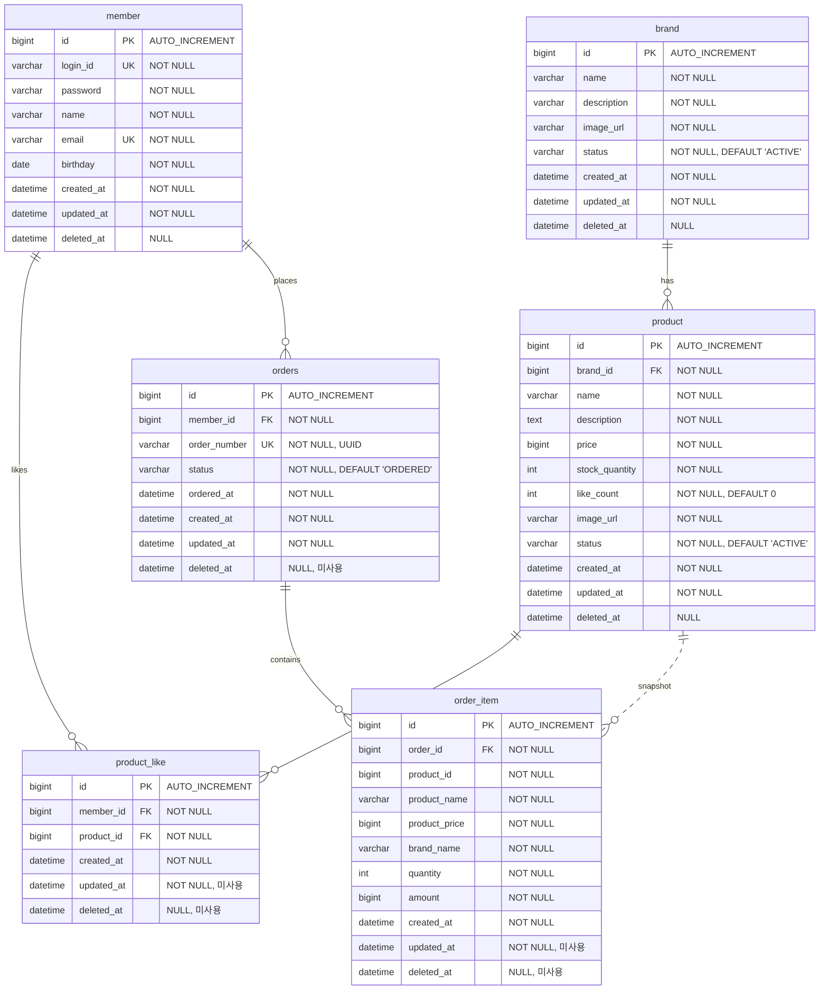

# 04. ERD (Entity-Relationship Diagram)

---

## 1. 전체 ERD

### 다이어그램의 목적

전체 테이블 구조와 관계를 정의한다. 논리적 FK 관계를 표현하되, 물리적 FK 제약은 걸지 않는다 (향후 서비스 분리 대비).

### 관계 해석

| 관계 | 유형 | 설명 |
|------|------|------|
| brand → product | 1:N | 브랜드 하나에 여러 상품 |
| member → product_like | 1:N | 회원 한 명이 여러 상품에 좋아요 |
| product → product_like | 1:N | 상품 하나에 여러 좋아요 |
| member → orders | 1:N | 회원 한 명이 여러 주문 |
| orders → order_item | 1:N | 주문 하나에 여러 상품 |
| product ··· order_item | 스냅샷 (비식별, 점선) | 주문 시점의 상품 정보를 복사. product_id는 FK가 아닌 추적용 참조. 비식별 관계(dotted line)로 표현 |

### BaseEntity 상속 전략

모든 엔티티는 `BaseEntity`(`id`, `createdAt`, `updatedAt`, `deletedAt`, `delete()`, `guard()`)를 상속한다. 단, 일부 컬럼은 테이블별로 활용 여부가 다르다:

| 테이블 | updated_at | deleted_at | 이유 |
|--------|-----------|-----------|------|
| member | 사용 | 사용 | 비밀번호 변경 등 수정 발생. soft delete 적용 |
| brand | 사용 | 사용 | 수정 API 존재. soft delete 적용 |
| product | 사용 | 사용 | 수정 API 존재. soft delete 적용 |
| product_like | 미사용 | 미사용 | 생성/물리삭제만 수행. BaseEntity 상속으로 컬럼 존재하나 비활용 |
| orders | 사용 | 미사용 | 상태 변경(ORDERED→CANCELLED) 시 갱신. 주문 이력 영구 보존 |
| order_item | 미사용 | 미사용 | 생성 후 불변. 주문 스냅샷 영구 보존 |

> `BaseEntity`를 상속하면 JPA가 `updated_at`, `deleted_at` 컬럼을 자동 생성한다. 일부 테이블에서 이 컬럼을 사용하지 않지만, 상속 구조 일관성과 구현 단순성을 위해 유지한다.

---

## 2. 테이블별 상세 명세

### 2.1 member (기존)

> 1주차에 구현 완료. VO 패턴 적용 (LoginId, MemberName, Email), `@MemberAuthenticated` 인증 패턴 적용, 비밀번호 변경 시 auth-cache eviction 추가.

| 컬럼 | 타입 | 제약 | 설명 |
|------|------|------|------|
| id | BIGINT | PK, AUTO_INCREMENT | 회원 고유 ID |
| login_id | VARCHAR(255) | NOT NULL, UNIQUE | 로그인 ID |
| password | VARCHAR(255) | NOT NULL | BCrypt 암호화 비밀번호 |
| name | VARCHAR(255) | NOT NULL | 이름 |
| email | VARCHAR(255) | NOT NULL, UNIQUE | 이메일 |
| birthday | DATE | NOT NULL | 생년월일 |
| created_at | DATETIME | NOT NULL | 생성 일시 |
| updated_at | DATETIME | NOT NULL | 수정 일시 |
| deleted_at | DATETIME | NULL | 삭제 일시 (soft delete) |

---

### 2.2 brand

| 컬럼 | 타입 | 제약 | 설명 |
|------|------|------|------|
| id | BIGINT | PK, AUTO_INCREMENT | 브랜드 고유 ID |
| name | VARCHAR(255) | NOT NULL | 브랜드명 (중복 허용, BR-B2 수정) |
| description | VARCHAR(255) | NOT NULL | 브랜드 설명 |
| image_url | VARCHAR(512) | NOT NULL | 브랜드 이미지 URL |
| status | VARCHAR(20) | NOT NULL, DEFAULT 'ACTIVE' | ACTIVE / DELETED |
| created_at | DATETIME | NOT NULL | 생성 일시 |
| updated_at | DATETIME | NOT NULL | 수정 일시 |
| deleted_at | DATETIME | NULL | 삭제 일시 (soft delete) |

**설계 근거**:
- `status`로 soft delete 구현. 삭제된 브랜드의 상품이 주문 스냅샷에 남아있으므로 물리 삭제 불가.
- `name` 중복 허용 (BR-B2 수정). 브랜드 식별은 PK 기반. soft delete + UNIQUE 충돌 방지 및 동명 브랜드 허용.

---

### 2.3 product

| 컬럼 | 타입 | 제약 | 설명 |
|------|------|------|------|
| id | BIGINT | PK, AUTO_INCREMENT | 상품 고유 ID |
| brand_id | BIGINT | NOT NULL | 브랜드 ID (논리적 FK) |
| name | VARCHAR(255) | NOT NULL | 상품명 |
| description | TEXT | NOT NULL | 상품 설명 |
| price | BIGINT | NOT NULL | 가격 (원 단위, 0 이상) |
| stock_quantity | INT | NOT NULL | 재고 수량 (0 이상) |
| like_count | INT | NOT NULL, DEFAULT 0 | 좋아요 수 (배치 갱신) |
| image_url | VARCHAR(512) | NOT NULL | 상품 이미지 URL |
| status | VARCHAR(20) | NOT NULL, DEFAULT 'ACTIVE' | ACTIVE / DELETED |
| created_at | DATETIME | NOT NULL | 생성 일시 |
| updated_at | DATETIME | NOT NULL | 수정 일시 |
| deleted_at | DATETIME | NULL | 삭제 일시 (soft delete) |

**설계 근거**:
- `description`은 TEXT 타입. 상품 설명은 255자를 초과할 수 있음.
- `price`는 BIGINT. 원 단위 정수 표현으로 소수점 연산 오류 방지.
- `brand_id`는 물리 FK를 걸지 않음. 애플리케이션 레벨에서 브랜드 존재 검증 (BR-P1).
- `brand_id`는 등록 후 수정 불가 (BR-P2). 도메인 모델에서 `protected set`으로 보장.

---

### 2.4 product_like

| 컬럼 | 타입 | 제약 | 설명 |
|------|------|------|------|
| id | BIGINT | PK, AUTO_INCREMENT | 좋아요 고유 ID |
| member_id | BIGINT | NOT NULL | 회원 ID (논리적 FK) |
| product_id | BIGINT | NOT NULL | 상품 ID (논리적 FK) |
| created_at | DATETIME | NOT NULL | 좋아요 등록 일시 |
| updated_at | DATETIME | NOT NULL | 미사용 (BaseEntity 상속으로 존재) |
| deleted_at | DATETIME | NULL | 미사용 (BaseEntity 상속으로 존재) |

**제약조건**: `UNIQUE(member_id, product_id)` — 동일 상품 중복 좋아요 방지 (BR-L1)

**설계 근거**:
- soft delete 미적용. 좋아요 취소는 물리 삭제 (DELETE). 좋아요 이력 추적이 요구사항에 없음.
- UNIQUE Constraint로 중복 방지. 사전 조회 대신 Constraint + 예외 처리 (아키텍처 원칙).

---

### 2.5 orders

| 컬럼 | 타입 | 제약 | 설명 |
|------|------|------|------|
| id | BIGINT | PK, AUTO_INCREMENT | 주문 고유 ID |
| member_id | BIGINT | NOT NULL | 회원 ID (논리적 FK) |
| order_number | VARCHAR(36) | NOT NULL, UNIQUE | 주문 번호 (UUID) |
| status | VARCHAR(20) | NOT NULL, DEFAULT 'ORDERED' | ORDERED / CANCELLED |
| ordered_at | DATETIME | NOT NULL | 주문 일시 |
| created_at | DATETIME | NOT NULL | 생성 일시 |
| updated_at | DATETIME | NOT NULL | 수정 일시 |
| deleted_at | DATETIME | NULL | 미사용 (BaseEntity 상속으로 존재) |

**설계 근거**:
- `total_amount` 컬럼 미사용. 주문 총액은 `SUM(order_item.amount)`로 계산. 주문당 아이템 수가 소량(1~5건)이므로 JOIN + SUM 비용이 미비하며, 비정규화로 인한 데이터 불일치 위험을 제거.
- `order_number`는 UUID. 내부 auto-increment ID 노출 방지 (일일 주문량 추측 차단, 서비스 분리 시 ID 체계 독립성 확보).
- soft delete 미적용. 주문은 `status`(ORDERED → CANCELLED)로 상태 관리. 주문 이력은 영구 보존.
- `ordered_at`과 `created_at` 분리. `ordered_at`은 비즈니스 주문 시각, `created_at`은 레코드 생성 시각. 기간 필터 쿼리는 `ordered_at` 기준.
- 테이블명 `orders`. MySQL 예약어 `ORDER` 회피.

---

### 2.6 order_item

| 컬럼 | 타입 | 제약 | 설명 |
|------|------|------|------|
| id | BIGINT | PK, AUTO_INCREMENT | 주문 상품 고유 ID |
| order_id | BIGINT | NOT NULL | 주문 ID (논리적 FK) |
| product_id | BIGINT | NOT NULL | 상품 ID (참조용, 스냅샷과 무관) |
| product_name | VARCHAR(255) | NOT NULL | 주문 시점 상품명 (스냅샷) |
| product_price | BIGINT | NOT NULL | 주문 시점 상품 가격 (스냅샷) |
| brand_name | VARCHAR(255) | NOT NULL | 주문 시점 브랜드명 (스냅샷) |
| quantity | INT | NOT NULL | 주문 수량 |
| amount | BIGINT | NOT NULL | 소계 (product_price × quantity) |
| created_at | DATETIME | NOT NULL | 생성 일시 |
| updated_at | DATETIME | NOT NULL | 미사용 (BaseEntity 상속으로 존재) |
| deleted_at | DATETIME | NULL | 미사용 (BaseEntity 상속으로 존재) |

**필드 역할 분류**:

| 구분 | 컬럼 | 설명 |
|------|------|------|
| 참조 | `order_id` | 소속 주문 |
| 참조 | `product_id` | 원본 상품 추적용 (표시에는 스냅샷 사용) |
| 스냅샷 | `product_name` | 주문 시점 상품명 (Product.name 복사) |
| 스냅샷 | `product_price` | 주문 시점 단가 (Product.price 복사) |
| 스냅샷 | `brand_name` | 주문 시점 브랜드명 (Brand.name 복사) |
| 주문 입력 | `quantity` | 사용자가 지정한 주문 수량 |
| 파생값 | `amount` | product_price × quantity 소계 (비정규화) |

**설계 근거**:
- **스냅샷 원칙** (BR-O2): `product_name`, `product_price`, `brand_name`은 주문 시점의 값을 복사. 상품/브랜드 정보 변경이 주문 이력에 영향을 주지 않음.
- **스냅샷 범위**: 주문 이력 표시에 필요한 최소 정보만 복사. `image_url`, `description` 등은 주문 상세의 필수 표시 항목이 아니므로 스냅샷 대상에서 제외.
- `product_id`는 원본 상품 추적용으로 보존하되, 실제 표시에는 스냅샷 필드를 사용.
- `quantity`는 사용자 주문 입력값. `amount`는 `product_price × quantity`의 비정규화. 애플리케이션에서 계산 후 저장하여 DB 조회 시 재계산 불필요.
- 주문 총액은 `orders` 테이블에 비정규화하지 않고 `SUM(order_item.amount)`로 계산. 주문당 아이템 수가 소량이므로 연산 비용 미비.

---

## 3. 인덱스 전략

### 3.1 인덱스 목록

| 테이블 | 인덱스 | 타입 | 용도 |
|--------|--------|------|------|
| member | `uk_member_login_id` | UNIQUE | 로그인 ID 조회/중복 방지 |
| member | `uk_member_email` | UNIQUE | 이메일 중복 방지 |
| brand | `idx_brand_name` | INDEX | 브랜드명 검색 (BR-B2 수정: 중복 허용) |
| product | `idx_product_brand_id` | INDEX | 브랜드별 상품 필터링 |
| product | `idx_product_status_created_at` | INDEX | 활성 상품 최신순 정렬 |
| product | `idx_product_status_price` | INDEX | 활성 상품 가격순 정렬 |
| product | `idx_product_status_like_count` | INDEX | 활성 상품 좋아요순 정렬 |
| product_like | `uk_product_like_member_product` | UNIQUE | 중복 좋아요 방지 (BR-L1) |
| product_like | `idx_product_like_member_id` | INDEX | 내가 좋아요한 상품 조회 |
| product_like | `idx_product_like_product_id` | INDEX | 배치 집계 시 상품별 COUNT |
| orders | `uk_orders_order_number` | UNIQUE | 주문 번호 조회 |
| orders | `idx_orders_member_ordered_at` | INDEX | 회원별 기간 주문 조회 |
| order_item | `idx_order_item_order_id` | INDEX | 주문별 상품 목록 조회 |

### 3.2 인덱스 설계 근거

**복합 인덱스 `idx_product_status_created_at`**:
- 대고객 상품 목록은 ACTIVE 상태만 필터링 + 최신순 정렬. `WHERE status = 'ACTIVE' ORDER BY created_at DESC`에 최적.
- `status`가 선행 컬럼인 이유: 카디널리티는 낮지만 필수 필터 조건이므로 range scan 범위를 줄여줌.

**복합 인덱스 `idx_orders_member_ordered_at`**:
- 주문 목록 조회 쿼리: `WHERE member_id = ? AND ordered_at BETWEEN ? AND ?`
- `member_id`가 선행 컬럼 (등치 조건) → `ordered_at`이 후행 컬럼 (범위 조건). B-Tree 인덱스 활용 극대화.

**`uk_product_like_member_product`**:
- `(member_id, product_id)` 순서. 내 좋아요 목록 조회(`WHERE member_id = ?`)에도 활용 가능하므로 `idx_product_like_member_id`와 일부 중복이나, UNIQUE 제약과 조회 성능을 모두 충족.

**복합 인덱스 `idx_product_status_like_count`**:
- 대고객 상품 목록 좋아요순 정렬: `WHERE status = 'ACTIVE' ORDER BY like_count DESC`.
- `idx_product_status_created_at`와 동일한 패턴. 정렬 기준별 인덱스 분리.

---

## 4. 설계 판단 요약

| 판단 | 결정 | 근거 |
|------|------|------|
| FK 전략 | 물리 FK 미사용, 논리적 참조만 | 향후 서비스 분리 대비. 애플리케이션 레벨에서 참조 무결성 보장 |
| 브랜드명 중복 | 허용 (UNIQUE 제거) | soft delete + UNIQUE 충돌 방지. 브랜드 식별은 PK 기반 (BR-B2 수정) |
| 좋아요 수 집계 | product.like_count 컬럼 + 배치 갱신 | 10K TPS 대응. 런타임 COUNT 부하 제거. DEFAULT 0으로 별도 초기화 불필요 |
| 주문 번호 | UUID | 내부 ID 노출 방지. 서비스 분리 시 ID 체계 독립성 |
| 주문 soft delete | 미적용 (상태 관리) | 주문 이력 영구 보존. ORDERED/CANCELLED 상태로 관리 |
| 상품 설명 타입 | TEXT | VARCHAR(255) 초과 가능성. 상품 설명 특성상 장문 허용 |
| 가격/금액 타입 | BIGINT | 원 단위 정수. 소수점 연산 오류 방지 |
| 스냅샷 저장 | order_item에 비정규화 | 상품/브랜드 변경이 주문 이력에 영향 없도록 보장 (BR-O2) |
| 주문 총액 | orders에 비정규화 안 함 | SUM(order_item.amount)로 계산. 아이템 소량으로 비용 미비, 데이터 불일치 방지 |
| 랭킹 확장 | 별도 일별 통계 테이블 예정 | 확장 시 `product_like_daily_stats(product_id, stat_date, count)` 추가 |
